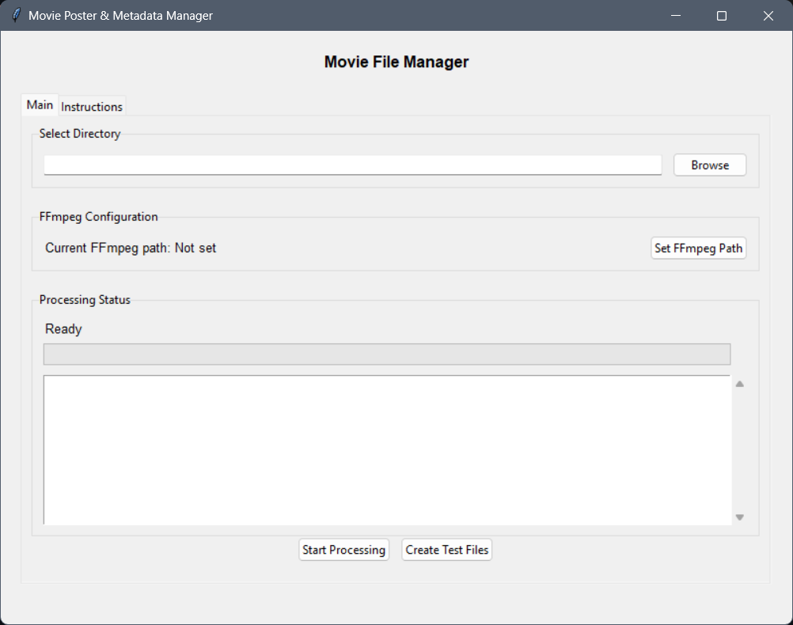

# Movie Poster & Metadata Manager

A Python application that automatically processes movie files by fetching metadata from IMDb through Cinemagoer, downloading movie posters, and setting them as video thumbnails.

## Features

- 🎬 Fetches movie metadata using Cinemagoer (IMDbPY)
- 🖼️ Downloads and sets movie posters as video thumbnails
- 📝 Renames files to match movie titles
- 📊 Logs processing history in CSV format
- ⚡ Multi-threaded processing
- 🧪 Test file generation for demo purposes

## Dependencies

This project relies on the following open-source libraries:

### Core Dependencies
- [Cinemagoer (IMDbPY)](https://cinemagoer.github.io/) - Python package for retrieving and managing IMDb movie information
- [FFmpeg](https://ffmpeg.org/) - Complete, cross-platform solution for video processing
- [Pillow (PIL)](https://python-pillow.org/) - Python Imaging Library for image processing
- [Beautiful Soup 4](https://www.crummy.com/software/BeautifulSoup/) - Library for pulling data out of HTML and XML files
- [Requests](https://docs.python-requests.org/en/latest/) - HTTP library for Python

### GUI Dependencies
- [Tkinter](https://docs.python.org/3/library/tkinter.html) - Standard GUI library for Python

### Version Requirements
```txt
beautifulsoup4>=4.12.2
Pillow>=10.0.0
requests>=2.31.0
cinemagoer>=2023.5.1
```

## Installation Options

### Option 1: Executable (Windows)
1. Download the latest release `.exe` file from the [Releases](https://github.com/ericjada/Movie_Poster_Metadata_Manager/releases) page
2. Download FFmpeg:
   - Visit [https://ffmpeg.org/download.html](https://ffmpeg.org/download.html)
   - Download the Windows build
   - Extract the archive
   - Note the path to `ffmpeg.exe` in the `bin` folder

### Option 2: Python Source
#### Prerequisites
- Python 3.8+
- FFmpeg installed on your system
- Windows OS (for thumbnail functionality)

#### Required Python Packages
```bash
pip install -r requirements.txt
```

#### Setup from Source
1. Clone the repository:
```bash
git clone https://github.com/ericjada/Movie_Poster_Metadata_Manager.git
cd Movie_Poster_Metadata_Manager
```

2. Install dependencies:
```bash
pip install -r requirements.txt
```

## Usage

### Using the Executable
1. Launch `Movie_Poster_Metadata_Manager.exe`
2. Click "Set FFmpeg Path" and select your `ffmpeg.exe`
3. Click "Browse" to select your movies folder
4. Click "Start Processing"

### Using Python Source
1. Run the application:
```bash
python Movie_Poster_Metadata_Manager.py
```

2. Follow the same steps as executable usage

### First-Time Setup
1. Set FFmpeg path using the "Set FFmpeg Path" button
2. The path will be saved for future use

### Processing Movies
1. Select a folder containing movie files
2. (Optional) Create test files using "Create Test Files"
3. Click "Start Processing"
4. Monitor progress in the status window

### Supported File Formats
- MP4 (.mp4)
- MKV (.mkv)
- AVI (.avi)
- MOV (.mov)
- WMV (.wmv)

## Generated Files

The application creates:
- `thumbnails/` directory containing movie posters
- `processed_movies.csv` log file with detailed metadata
- `config.json` storing FFmpeg path

## Troubleshooting

1. FFmpeg Issues:
   - Ensure FFmpeg is properly downloaded and extracted
   - Verify the path in "Set FFmpeg Path" points to `ffmpeg.exe`
   - Check the status window for FFmpeg-related errors

2. Processing Issues:
   - Verify internet connection for Cinemagoer API access
   - Ensure write permissions in the movie folder
   - Check the status window for detailed error messages

3. Common Problems:
   - "FFmpeg not found": Reset the FFmpeg path
   - "Permission denied": Run as administrator
   - "No poster found": Check movie filename accuracy

## Disclaimer

This software is provided "as is" without warranty of any kind, either express or implied. Use at your own risk.

- This application is an independent project and is not affiliated with, endorsed by, or connected to IMDb, Cinemagoer, Amazon, or any movie studios.
- Movie metadata and poster images are fetched using the Cinemagoer library for personal use only. Users are responsible for ensuring their use of this data complies with Cinemagoer's and IMDb's terms of service and applicable copyright laws.
- The developers are not responsible for:
  - Any damage to files or systems caused by the use of this software
  - The accuracy of metadata retrieved through Cinemagoer
  - Any copyright infringement resulting from the use of downloaded images or metadata
  - Issues arising from incorrect file naming or metadata matching
  - Data loss during file renaming or processing

By using this software, you acknowledge that:
1. You have backup copies of any files you process with this tool
2. You are using the software for personal, non-commercial use
3. You accept all risks associated with automated file renaming and metadata modification

For commercial use or integration, please review Cinemagoer's and IMDb's terms of service and obtain necessary permissions.

## License

This project is licensed under the MIT License - see the LICENSE file for details.

## Support

For support:
1. Check the Instructions tab in the application
2. Review troubleshooting steps in this README
3. Open an issue on GitHub
4. Contact the maintainers

## Screenshots


*Main interface of the Movie Poster Metadata Manager showing the directory selection, FFmpeg configuration, and processing status.*
